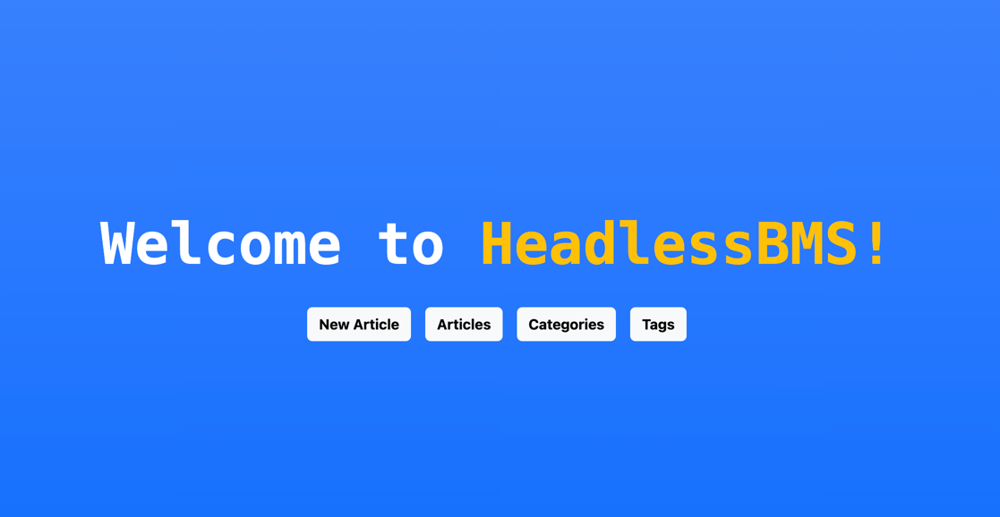

# HeadlessBMS powered by spring boot



The "BMS" in HeadlessBMS stands for "Blog Management System," which is designed to enable everyone to create and customize their blogs with ease.
So, let's dive into the world of blogging and make it an enjoyable experience!
However, please be aware that this open-source is not fully operational at the moment, so I kindly ask for your patience.

## Commands

### Run application and db

```bash
make run
```

### Run application only

```bash
make run-app
```

### Run db only

```bash
make run-db
```

## Endpoint

- GET: /api/articles  Return all articles

## Pages

- /admin/articles  Show all articles

## Miscellaneous

### Thymeleaf
- th:href https://www.thymeleaf.org/doc/articles/standardurlsyntax.html 
